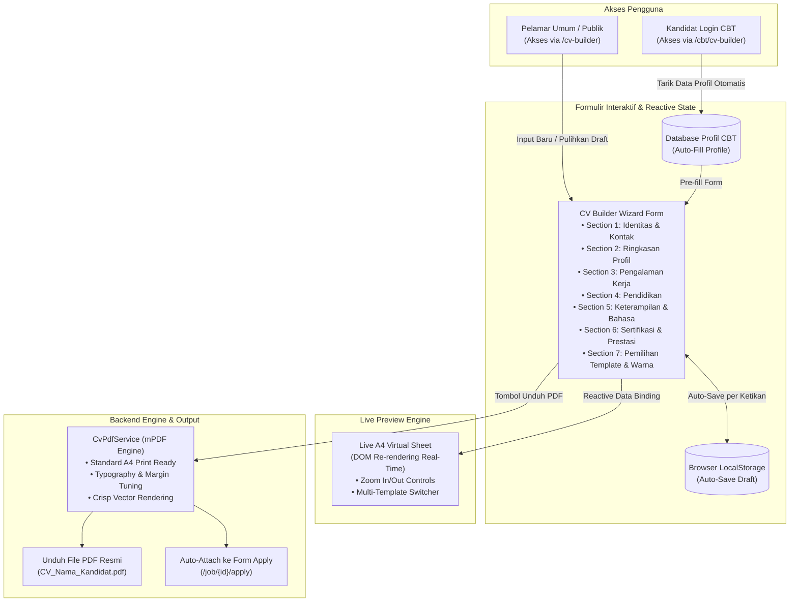

# 📄 Rencana Implementasi: Fitur CV Builder Profesional Kandidat ASystem

Dokumen ini memuat arsitektur sistem, struktur formulir input, pilihan template desain, sistem live preview interaktif, engine konversi PDF A4, serta tahapan eksekusi untuk membangun fitur **CV Builder** pada platform ASystem Portal.

---

## 🎯 1. Ringkasan Kebutuhan & Tujuan Fitur

1. **Membantu Kandidat Membuat CV Profesional & Lengkap**:
   - Kandidat sering kali kesulitan menyusun format CV yang menarik, rapi, dan memenuhi kriteria seleksi HRD/Mitra (*ATS-Friendly*).
   - Fitur CV Builder menyediakan formulir terpandu (*step-by-step guided form*) yang mengarahkan kandidat untuk melengkapi seluruh data penting (Data Diri, Profil Ringkas, Pengalaman Kerja, Pendidikan, Keterampilan, Bahasa, dan Sertifikasi).

2. **Koleksi Template Desain Modern**:
   - Pilihan beberapa template CV profesional berstandar industri:
     - **Template 1: Modern Sapphire (2 Kolom)** — Desain elegan dua kolom bernuansa ESA Groups, ideal untuk kandidat lapangan, sales, dan operasional.
     - **Template 2: Minimalist ATS-Friendly (1 Kolom)** — Format klasik bersih tanpa grafis berlebih, optimal untuk keterbacaan bot HRD dan screening cepat.
     - **Template 3: Executive Corporate (Formal)** — Desain berbobot dengan header formal dan aksen garis elegan, cocok untuk level koordinator, SPV, dan manajerial.
     - **Template 4: Creative Professional** — Tata letak dinamis dengan badge keterampilan visual, cocok untuk posisi marketing, digital, dan kreatif.
   - Pilihan palet warna aksen (*Sapphire Blue, Emerald Green, Slate Dark, Ruby Burgundy, Classic Navy*).

3. **Fitur Live Interactive Preview (Pratinjau Instan)**:
   - Kandidat dapat melihat simulasi tampilan CV secara langsung di lembar kerja virtual A4 (split-screen di desktop atau floating preview di mobile).
   - Setiap ketikan atau perubahan data di form langsung merefleksikan hasil visualnya secara *real-time* tanpa perlu reload halaman.

4. **Ekspor PDF Berkualitas Tinggi & Integrasi Melamar Lowongan**:
   - Hasil akhir dapat langsung diunduh dalam format berkas **PDF ukuran A4** yang tajam dan siap cetak menggunakan engine mPDF.
   - Terdapat tombol pintasan **"Gunakan CV Ini untuk Melamar di ASystem"** yang otomatis menyematkan file CV ke formulir apply lowongan kerja publik (`/job/{id}/apply`).
   - Kandidat yang sudah memiliki akun di portal CBT (`/cbt`) dapat memanfaatkan tombol **"Muat Otomatis dari Profil CBT"** agar tidak perlu mengetik ulang data diri dan pengalaman kerja yang pernah diinput.

---

## 🏗️ 2. Arsitektur Alur Sistem (System Architecture)



---

## 📋 3. Struktur Bagian Formulir Input Data CV

Formulir dirancang adaptif menggunakan komponen *Accordion / Step Wizard* yang rapi:

### Section 1: Informasi Pribadi & Kontak (Personal Information)
- **Nama Lengkap & Gelar** (`full_name`)
- **Headline / Posisi Profesi yang Dituju** (`job_title_headline`, contoh: *Direct Sales Executive, Admin Operasional, Beauty Advisor, Field Supervisor*)
- **Email Aktif** (`email`)
- **Nomor WhatsApp / Telepon** (`phone_number`)
- **Domisili / Kota & Provinsi** (`city`, `province`)
- **Alamat Singkat** (`address`)
- **Tautan LinkedIn / Portofolio** (`linkedin_url`, `portfolio_url` - opsional)
- **Pas Foto Profil** (`photo`: upload file, crop persegi otomatis, atau opsi toggle *"Sembunyikan Foto di CV"* untuk format ATS murni).

### Section 2: Ringkasan Profesional (Professional Summary / About Me)
- **Deskripsi Singkat Diri** (3–5 kalimat yang merangkum pengalaman, etos kerja, dan motivasi kontribusi).
- **Fitur Bantuan Saran Deskripsi**: Tombol bantuan template teks (*Pre-written Templates*) untuk berbagai kategori pekerjaan (Sales/SPG/SPB, Administrasi/Keuangan, Operasional Gudang/Logistik, Customer Service, Fresh Graduate).

### Section 3: Riwayat Pengalaman Kerja (Work Experience) — Dynamic Repeater
Kandidat dapat menambahkan lebih dari satu riwayat pekerjaan:
- Nama Perusahaan / Instansi (`company_name`)
- Posisi / Jabatan (`position`)
- Kota / Lokasi Kerja (`location`)
- Tanggal Mulai & Tanggal Selesai (`start_date`, `end_date`)
- Checkbox *"Masih Bekerja di Sini (Present)"*
- Tanggung Jawab & Pencapaian Utama (`job_description`: format poin-poin bullet).

### Section 4: Riwayat Pendidikan (Education) — Dynamic Repeater
- Nama Institusi / Universitas / Sekolah (`institution_name`)
- Jenjang Pendidikan (`degree`: SMA/SMK, Diploma D3, Sarjana S1, Pascasarjana S2)
- Jurusan / Program Studi (`field_of_study`)
- Tahun Kelulusan (`graduation_year`)
- Nilai Akhir / IPK (`gpa` - opsional).

### Section 5: Keterampilan & Bahasa (Skills & Languages)
- **Hard Skills & Alat Kerja**: Input interaktif berupa tag badge (misal: *Microsoft Excel, VLOOKUP, Kasir / POS, Merchandising, Stock Opname, Direct Selling, Negosiasi*).
- **Soft Skills**: Tag badge (misal: *Komunikasi, Kerjasama Tim, Manajemen Waktu, Ketelitian*).
- **Penguasaan Bahasa**: Repeater bahasa (Bahasa Indonesia, Bahasa Inggris, dll.) dengan tingkatan kemahiran (*Dasar, Menengah, Mahir, Penutur Asli*).

### Section 6: Sertifikasi & Pelatihan (Certifications & Training) — Opsional
- Nama Sertifikat / Pelatihan (`cert_name`)
- Lembaga Penerbit (`issuing_org`)
- Tahun Terbit (`cert_year`).

---

## 🎨 4. Pilihan Template Desain CV

Kandidat dapat berganti template kapan saja tanpa kehilangan data yang sudah diketik:

| Template | Karakteristik Desain | Tipe Kandidat yang Direkomendasikan |
| :--- | :--- | :--- |
| **1. Modern Sapphire** | Tata letak dua kolom (sidebar kiri untuk foto, kontak, skill, bahasa; kolom kanan untuk ringkasan, riwayat kerja, dan pendidikan) dengan aksen warna Sapphire Blue ESA Groups. | Cocok untuk kandidat umum, sales, marketing, staf kantor, dan frontliner. |
| **2. Clean ATS-Friendly** | Tata letak satu kolom murni tanpa tabel kompleks, tipografi hitam-putih presisi, pembatas garis halus. 100% lolos pemindaian software HRD (ATS parser). | Sangat direkomendasikan untuk lowongan perusahaan besar, BUMN, perbankan, dan posisi formal. |
| **3. Executive Corporate** | Header formal dengan pita aksen elegan, penempatan foto di sisi kanan atas, garis waktu (*timeline*) rapi pada riwayat kerja. | Ideal untuk posisi Koordinator Area, Supervisor, Team Leader, dan Manajer. |
| **4. Vibrant Minimal** | Desain segar dengan badge pill berwarna pada keterampilan dan ikon modern di samping judul bagian. | Cocok untuk fresh graduate, posisi kreatif, promotor produk, dan digital specialist. |

### Palet Warna Aksen (Accent Colors):
- 🔵 **Royal Sapphire** (`#0284c7` / `#0369a1`) — Warna resmi ESA Groups.
- 🟢 **Emerald Slate** (`#059669` / `#047857`) — Nuansa segar dan terpercaya.
- ⚫ **Charcoal Monochrome** (`#1e293b` / `#334155`) — Standar korporat klasik.
- 🔴 **Crimson Ruby** (`#b91c1c` / `#991b1b`) — Tegas dan berenergi.
- 🟣 **Indigo Velvet** (`#6366f1` / `#4f46e5`) — Modern dan kreatif.

---

## 👁️ 5. Desain Antarmuka Live Preview Interaktif

1. **Tata Letak Responsif (Desktop & Mobile)**:
   - **Mode Desktop (`lg:grid-cols-12`)**:
     - Sisi Kiri (7 kolom): Formulir pengisian data bertahap dengan navigasi accordion yang mulus.
     - Sisi Kanan (5 kolom - Sticky Container): Lembar kertas virtual A4 (*live rendering preview*) yang mengikuti guliran layar, lengkap dengan toolbar:
       - Dropdown Ganti Template.
       - Color Picker Bulat (pilihan warna aksen).
       - Kontrol Skala Zoom (75%, 100%, 125%, Fit to Screen).
       - Tombol Utama: **"📥 Unduh CV (PDF)"** dan **"💼 Cari Lowongan Terkait"**.
   - **Mode Smartphone / Layar Sentuh**:
     - Formulir satu kolom penuh dengan floating action button (FAB) melayang di kanan bawah: **"👁️ Pratinjau CV"** yang membuka drawer layar penuh untuk mengecek hasil secara instan.

2. **Mekanisme Penyimpanan Draft Anti-Hilang (Auto-Save)**:
   - Setiap event `input` atau `change` pada formulir otomatis mendongkrak data ke `localStorage.setItem('asystem_cv_builder_draft', JSON.stringify(data))`.
   - Jika browser tertutup, komputer restart, atau koneksi terputus, data form otomatis dimuat kembali saat kandidat membuka halaman tersebut, dilengkapi tombol *"Reset Formulir"* jika ingin memulai dari lembar kosong.

---

## 🖨️ 6. Arsitektur Engine Pembuatan PDF (mPDF Service)

### 6.1. Service: `App\Services\CvPdfService`
Service khusus untuk menyusun HTML template dan merendernya ke format biner PDF ukuran A4:

```php
namespace App\Services;

use Mpdf\Mpdf;
use Illuminate\Support\Facades\View;

class CvPdfService
{
    public static function generatePdf(array $cvData, string $template = 'modern', string $color = 'sapphire'): string
    {
        // 1. Tentukan view template yang dipilih
        $viewName = "cv_builder.templates.{$template}";
        if (!View::exists($viewName)) {
            $viewName = "cv_builder.templates.modern";
        }

        // 2. Render HTML dengan data kandidat dan warna aksen
        $html = View::make($viewName, [
            'data' => $cvData,
            'accentColor' => self::resolveColorHex($color),
        ])->render();

        // 3. Konfigurasi mPDF standar ukuran kertas A4 (210 x 297 mm)
        $mpdf = new Mpdf([
            'mode' => 'utf-8',
            'format' => 'A4',
            'orientation' => 'P',
            'margin_left' => 10,
            'margin_right' => 10,
            'margin_top' => 10,
            'margin_bottom' => 10,
            'tempDir' => storage_path('app/temp-pdf'),
        ]);

        $mpdf->SetTitle("Curriculum Vitae - " . ($cvData['full_name'] ?? 'Kandidat'));
        $mpdf->SetAuthor("ASystem Portal");
        $mpdf->WriteHTML($html);

        return $mpdf->Output('', 'S'); // Output sebagai binary string
    }

    private static function resolveColorHex(string $color): string
    {
        return match($color) {
            'emerald' => '#059669',
            'charcoal' => '#334155',
            'crimson' => '#b91c1c',
            'indigo' => '#4f46e5',
            default => '#0284c7', // Sapphire default
        };
    }
}
```

### 6.2. Controller: `App\Http\Controllers\CvBuilderController`
- `index()`: Menampilkan antarmuka formulir CV Builder & Live Preview.
- `loadProfile()`: Endpoint AJAX untuk menarik data kandidat yang sedang login di CBT.
- `previewPdf(Request $request)`: Mengembalikan streaming PDF langsung ke browser tab.
- `downloadPdf(Request $request)`: Mengunduh file `CV_{Nama}_{Tahun}.pdf` dengan header attachment resmi.
- `attachToApplication(Request $request)`: Menyimpan berkas CV yang di-generate ke folder lampiran dan mengarahkan kandidat ke pemilihan lowongan kerja aktif.

---

## 🚀 7. Rencana Tahapan Eksekusi (Implementation Phases)

| Tahap | Rincian Pekerjaan | Deliverables Teknis |
| :---: | :--- | :--- |
| **Fase 1** | **Rute, Controller & Kerangka Tampilan** | • Route `/cv-builder` dan `/cbt/cv-builder`.<br/>• `CvBuilderController.php`.<br/>• Layout view [resources/views/cv_builder/index.blade.php](file:///d:/ASystem/newasystem/resources/views/cv_builder/index.blade.php) dengan struktur form sectioned & layout split-screen. |
| **Fase 2** | **Desain 4 Template CV & CSS Print Engine** | • Pembuatan 4 file template Blade (`modern.blade.php`, `ats.blade.php`, `executive.blade.php`, `creative.blade.php`).<br/>• Penataan CSS Grid & Flexbox khusus mPDF (kompatibel penuh dengan ukuran A4). |
| **Fase 3** | **Live Interactive Reactive Preview (JS Engine)** | • Skrip Alpine.js / Vanilla JS untuk *reactive two-way data binding* antara input form dengan tampilan preview di layar.<br/>• Implementasi *auto-save* dan *restore* state di `localStorage`.<br/>• Kontrol zoom dan switch warna aksen dinamis. |
| **Fase 4** | **Engine Generator PDF (mPDF Integration)** | • `App\Services\CvPdfService.php`.<br/>• Endpoint download PDF dan preview streaming.<br/>• Penanganan gambar pas foto profil (konversi Base64 / path lokal) agar tajam dan tidak pecah. |
| **Fase 5** | **Integrasi Portal Lowongan & CBT** | • Tombol "Tarik Data dari Profil CBT" untuk kandidat terautentikasi.<br/>• Integrasi tombol "Lamar Lowongan dengan CV Ini" ke halaman `/job`.<br/>• Pengujian lintas perangkat (desktop, tablet, dan smartphone). |

---

## 💡 8. Nilai Tambah & Keunggulan bagi Kandidat ESA Groups

1. **Kemudahan Tanpa Hambatan (Zero Friction)**: Pelamar umum yang belum mendaftar akun dapat langsung membuat CV secara gratis dan instan.
2. **Kesesuaian Standar Seleksi HRD**: Template dirancang khusus oleh praktisi rekrutmen agar poin-poin yang paling dicari oleh recruiter (seperti riwayat kerja, angka pencapaian, dan skill spesifik) terpampang jelas di paruh atas (*above the fold*) CV.
3. **Peningkatan Kualitas Lamaran Kerja**: Mendorong kandidat melengkapi data secara komprehensif, sehingga skor kecocokan AI (*AI Candidate Ranking*) saat mereka melamar pekerjaan di ASystem menjadi lebih tinggi dan akurat.

---
*Dokumen ini dirancang sebagai acuan arsitektur dan panduan pengerjaan sebelum penulisan kode dimulai.*
