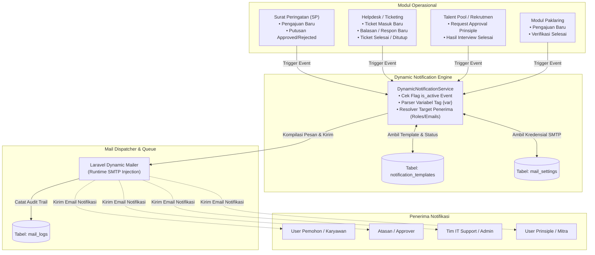

# 📧 Rencana Implementasi: Sistem Notifikasi Email Dinamis & Pengaturan SMTP ASystem

Dokumen ini memuat arsitektur, skema basis data, katalog event modul, desain antarmuka (UI/UX), serta tahapan eksekusi untuk membangun **Sistem Notifikasi Email Dinamis** dan **Pusat Pengaturan Server SMTP** pada platform ASystem Portal.

---

## 🎯 1. Ringkasan Kebutuhan & Tujuan Sistem

1. **Konfigurasi Server SMTP Terpusat**:
   - Administrator dapat mengatur kredensial mail server pengirim (Host, Port, User, Password, Encryption TLS/SSL, From Address, From Name) langsung dari dashboard web tanpa perlu menyentuh file `.env`.
   - Dilengkapi fitur **Uji Coba Pengiriman Email (Live Test Connection & Send Test Email)** untuk memverifikasi keabsahan kredensial SMTP secara *real-time*.

2. **Mesin Notifikasi Email Berbasis Event (Event-Driven Dynamic Notifications)**:
   - Setiap modul operasional (Surat Peringatan, Helpdesk Ticketing, Talent Pool Rekrutmen, dan Paklaring) dapat memicu notifikasi email secara otomatis berdasarkan status/alur kerja.
   - **Fleksibel & Dinamis**:
     - Status aktif notifikasi per event dapat dinyalakan/dimatikan (*Toggle On/Off*) kapan saja.
     - Penerima email (*Recipients*) dapat ditentukan secara dinamis (Pemohon/Karyawan, Atasan/Approver, Tim Support/IT, HRD, Administrator, atau custom email CC/BCC).
     - Subjek dan isi pesan (*body message*) dapat dikustomisasi per event menggunakan *visual editor* dan tag variabel dinamis (misal: `{nama_karyawan}`, `{nomor_sp}`, `{judul_ticket}`, `{action_url}`, dll.).

3. **Audit Trail & Log Pengiriman**:
   - Riwayat seluruh email yang dikirim tercatat dalam log (`mail_logs`), mencakup status (*Sent / Failed / Queued*), alamat penerima, subjek, waktu kirim, dan catatan error jika terjadi kegagalan koneksi.

---

## 🏗️ 2. Arsitektur Alur Sistem (System Architecture)



---

## 🗄️ 3. Desain Skema Basis Data (Database Schema)

### 3.1. Tabel `mail_settings` (Konfigurasi Akun SMTP)
Tabel tunggal untuk menyimpan parameter koneksi SMTP pengirim email sistem.

```sql
CREATE TABLE mail_settings (
    id INTEGER PRIMARY KEY AUTOINCREMENT,
    mail_driver VARCHAR(50) DEFAULT 'smtp',          -- smtp, sendmail, log
    mail_host VARCHAR(255) NULL,                    -- contoh: smtp.gmail.com / mail.asystem.co.id
    mail_port INTEGER DEFAULT 587,                   -- 587, 465, 25
    mail_username VARCHAR(255) NULL,                -- email akun pengirim
    mail_password TEXT NULL,                        -- password / app-password (terenkripsi)
    mail_encryption VARCHAR(20) DEFAULT 'tls',       -- tls, ssl, null
    mail_from_address VARCHAR(255) NULL,            -- noreply@asystem.co.id
    mail_from_name VARCHAR(255) DEFAULT 'ASystem',   -- ASystem Notifications
    is_active BOOLEAN DEFAULT 1,
    created_at TIMESTAMP NULL,
    updated_at TIMESTAMP NULL
);
```

### 3.2. Tabel `notification_templates` (Katalog Event & Template Pesan)
Menyimpan konfigurasi per event: status aktif, penerima dinamis, subjek, dan template HTML.

```sql
CREATE TABLE notification_templates (
    id INTEGER PRIMARY KEY AUTOINCREMENT,
    module VARCHAR(50) NOT NULL,                    -- warning_letter, helpdesk, interview, paklaring, auth
    event_code VARCHAR(100) NOT NULL UNIQUE,        -- sp_submitted, ticket_created, ticket_resolved, dll.
    event_name VARCHAR(255) NOT NULL,               -- Nama tampilan ramah pengguna
    description TEXT NULL,                          -- Penjelasan kapan event ini terpicu
    subject VARCHAR(255) NOT NULL,                  -- Subjek email dengan token variabel
    body_html TEXT NOT NULL,                        -- Konten pesan HTML / Markdown
    recipient_types TEXT NULL,                      -- JSON array: ["requester", "approver", "admin", "pic"]
    cc_emails TEXT NULL,                            -- Email statis tambahan (dipisah koma)
    bcc_emails TEXT NULL,                           -- Email blind carbon copy
    available_variables TEXT NULL,                  -- JSON array token yang dapat digunakan
    is_active BOOLEAN DEFAULT 1,                     -- Toggle switch on/off
    created_at TIMESTAMP NULL,
    updated_at TIMESTAMP NULL
);
```

### 3.3. Tabel `mail_logs` (Audit Trail Riwayat Pengiriman)
```sql
CREATE TABLE mail_logs (
    id INTEGER PRIMARY KEY AUTOINCREMENT,
    event_code VARCHAR(100) NULL,
    recipient_email VARCHAR(255) NOT NULL,
    recipient_name VARCHAR(255) NULL,
    subject VARCHAR(255) NOT NULL,
    status VARCHAR(50) NOT NULL,                    -- sent, failed, queued
    error_message TEXT NULL,
    payload_summary TEXT NULL,                      -- Ringkasan data trigger
    sent_at TIMESTAMP NULL,
    created_at TIMESTAMP NULL,
    updated_at TIMESTAMP NULL
);
CREATE INDEX idx_mail_logs_event ON mail_logs(event_code, status, created_at);
```

---

## 📋 4. Katalog Event Notifikasi Bawaan (Default Event Matrix)

Sistem akan dilengkapi daftar event default yang siap pakai sesuai modul-modul yang telah berjalan di ASystem:

| Modul | Kode Event (`event_code`) | Nama Event & Pemicu | Penerima Dinamis | Token Variabel yang Tersedia |
| :--- | :--- | :--- | :--- | :--- |
| **Surat Peringatan** | `sp_submitted` | Pengajuan SP Baru (terbuat saat user mengajukan SP) | Atasan / Approver 1, HRD Area | `{nama_karyawan}`, `{nik}`, `{jabatan}`, `{area}`, `{prinsiple}`, `{nomor_sp}`, `{tingkat_sp}`, `{alasan}`, `{nama_pengaju}`, `{action_url}` |
| **Surat Peringatan** | `sp_approved` | Putusan SP Disetujui (diterbitkan resmi) | Karyawan Terkait, Pembuat Pengajuan, HRD | `{nama_karyawan}`, `{nomor_sp}`, `{tingkat_sp}`, `{status_putusan}`, `{catatan_approver}`, `{tanggal_terbit}`, `{action_url}` |
| **Surat Peringatan** | `sp_rejected` | Pengajuan SP Ditolak | Pembuat Pengajuan | `{nama_karyawan}`, `{nomor_sp}`, `{alasan_penolakan}`, `{nama_approver}`, `{action_url}` |
| **Helpdesk Ticket** | `ticket_created` | Tiket Bantuan Baru Dibuat | Tim IT Support / Admin Helpdesk | `{ticket_code}`, `{ticket_title}`, `{ticket_priority}`, `{ticket_category}`, `{user_name}`, `{user_area}`, `{ticket_link}` |
| **Helpdesk Ticket** | `ticket_replied` | Balasan / Tanggapan Tiket Baru | Pembuat Tiket atau Tim Support | `{ticket_code}`, `{ticket_title}`, `{sender_name}`, `{reply_preview}`, `{ticket_link}` |
| **Helpdesk Ticket** | `ticket_closed` | Tiket Dinyatakan Selesai / Ditutup | Pembuat Tiket | `{ticket_code}`, `{ticket_title}`, `{solution_summary}`, `{closed_by}`, `{ticket_link}` |
| **Rekrutmen / Interview** | `interview_approval_request` | Permintaan Persetujuan Calon ke Prinsiple | User Prinsiple / Mitra Terkait | `{candidate_name}`, `{applied_job}`, `{interview_date}`, `{recruiter_name}`, `{approval_link}` |
| **Rekrutmen / Interview** | `interview_approved_principle` | Hasil Approval Kandidat dari Prinsiple | Recruiter / User AS Penilai | `{candidate_name}`, `{principle_name}`, `{approval_status}`, `{candidate_url}` |
| **Veklaring / Paklaring** | `paklaring_submitted` | Pengajuan Surat Pengalaman Kerja Baru | Tim Area (AS) / Verifikator | `{nama_karyawan}`, `{nik}`, `{prinsiple}`, `{area}`, `{tracking_code}`, `{action_url}` |
| **Veklaring / Paklaring** | `paklaring_completed` | Surat Keterangan Kerja Resmi Terbit | Karyawan / Pemohon | `{nama_karyawan}`, `{nomor_surat}`, `{kode_validasi}`, `{download_url}`, `{verify_url}` |

---

## 🎨 5. Desain Tampilan Antarmuka (UI/UX Mockup)

Halaman pengaturan ditempatkan pada rute baru khusus Administrator:
**`/master/mail-settings`** (*Sidebar Master Data &rarr; Pengaturan Email & Notifikasi*).

### 5.1. Struktur Tab Navigasi:
1. **Tab 1: ⚙️ Konfigurasi Server SMTP**
   - Form kartu modern dengan kolom: *Mail Driver*, *SMTP Host*, *Port*, *Tipe Enkripsi (TLS/SSL)*, *Username*, *Password (dengan toggle show/hide)*, *Alamat Email Pengirim*, dan *Nama Pengirim*.
   - **Panel Widget "Uji Koneksi & Kirim Email Percobaan"**:
     - Input alamat email tujuan (contoh: `admin@asystem.co.id`).
     - Tombol aksi **"Kirim Email Uji Coba"** dengan status spinner dan console output feedback (apakah koneksi handshake socket berhasil atau gagal).
2. **Tab 2: 🔔 Katalog Event & Template Notifikasi**
   - Filter kartu per kategori modul (*Semua, Surat Peringatan, Helpdesk, Rekrutmen, Paklaring*).
   - Tabel responsif menampilkan: Nama Event, Modul, Target Penerima, Status Switch (*Toggle Active/Inactive*), dan Tombol **"Edit Template"**.
3. **Tab 3 / Modal: ✏️ Editor Pesan & Dynamic Tags**
   - Input Subjek Email.
   - Textarea Editor Pesan HTML / Format Surat Resmi.
   - **Pill Badge Dynamic Tags**: Daftar variabel yang bisa di-klik sekali (*one-click copy*) untuk disisipkan ke dalam pesan (misal klik badge `{nama_karyawan}` langsung menyalin variabel tersebut).
   - Checkbox pilihan penerima (*Requester, Approver, Admin, HRD*) serta input field email CC/BCC tambahan.
   - **Live Preview Container**: Menampilkan pratinjau tampilan email asli berbingkai kartu resmi ASystem ESA Groups (kop logo, badan pesan, tombol aksi, dan footer).
4. **Tab 4: 📊 Log Pengiriman Email (`mail_logs`)**
   - Tabel riwayat pengiriman: Waktu, Kode Event, Penerima, Subjek, Status (*Sent / Failed*), dan modal detail pesan error jika gagal.

---

## 💻 6. Arsitektur Komponen Backend

### 6.1. Service: `App\Services\MailSettingService`
Bertanggung jawab memuat pengaturan SMTP dari database dan menyuntikkannya ke runtime konfigurasi Laravel:

```php
namespace App\Services;

use App\Models\MailSetting;
use Illuminate\Support\Facades\Config;
use Illuminate\Support\Facades\Mail;

class MailSettingService
{
    public static function applyRuntimeSmtpConfig(): void
    {
        $setting = MailSetting::first();
        if ($setting && $setting->is_active && !empty($setting->mail_host)) {
            Config::set('mail.default', $setting->mail_driver ?: 'smtp');
            Config::set('mail.mailers.smtp.host', $setting->mail_host);
            Config::set('mail.mailers.smtp.port', (int)$setting->mail_port);
            Config::set('mail.mailers.smtp.encryption', $setting->mail_encryption === 'none' ? null : $setting->mail_encryption);
            Config::set('mail.mailers.smtp.username', $setting->mail_username);
            Config::set('mail.mailers.smtp.password', $setting->mail_password);
            Config::set('mail.from.address', $setting->mail_from_address);
            Config::set('mail.from.name', $setting->mail_from_name);
        }
    }

    public static function testConnection(string $toEmail): array
    {
        self::applyRuntimeSmtpConfig();
        // Kirim email uji coba dan kembalikan response array ['success' => bool, 'message' => string]
    }
}
```

### 6.2. Service: `App\Services\DynamicNotificationService`
Helper tunggal yang dipanggil di berbagai Controller untuk memicu notifikasi:

```php
namespace App\Services;

use App\Models\NotificationTemplate;
use App\Models\MailLog;
use App\Mail\DynamicNotificationMail;
use Illuminate\Support\Facades\Mail;

class DynamicNotificationService
{
    public static function dispatch(string $eventCode, array $data, array $extraRecipients = []): bool
    {
        $template = NotificationTemplate::where('event_code', $eventCode)->where('is_active', true)->first();
        if (!$template) {
            return false; // Notifikasi tidak aktif atau template belum diset
        }

        // 1. Parsing subjek & konten HTML menggunakan variabel $data
        $subject = self::renderTemplate($template->subject, $data);
        $bodyHtml = self::renderTemplate($template->body_html, $data);

        // 2. Kumpulkan daftar email penerima berdasarkan recipient_types & extraRecipients
        $recipients = self::resolveRecipients($template, $data, $extraRecipients);

        // 3. Suntikkan konfigurasi SMTP runtime
        MailSettingService::applyRuntimeSmtpConfig();

        // 4. Eksekusi pengiriman email & catat ke mail_logs
        foreach ($recipients as $recipient) {
            try {
                Mail::to($recipient['email'])->send(new DynamicNotificationMail($subject, $bodyHtml, $data));
                MailLog::create([
                    'event_code' => $eventCode,
                    'recipient_email' => $recipient['email'],
                    'recipient_name' => $recipient['name'] ?? null,
                    'subject' => $subject,
                    'status' => 'sent',
                    'sent_at' => now(),
                ]);
            } catch (\Throwable $e) {
                MailLog::create([
                    'event_code' => $eventCode,
                    'recipient_email' => $recipient['email'],
                    'subject' => $subject,
                    'status' => 'failed',
                    'error_message' => $e->getMessage(),
                ]);
            }
        }

        return true;
    }

    private static function renderTemplate(string $text, array $data): string
    {
        foreach ($data as $key => $value) {
            if (is_scalar($value)) {
                $text = str_replace('{' . $key . '}', (string)$value, $text);
            }
        }
        return $text;
    }
}
```

### 6.3. Template Email Responsif ESA Groups (`resources/views/emails/dynamic_notification.blade.php`)
- Desain *card layout* bernuansa biru royal Sapphire ESA Groups.
- Header logo resmi ASystem.
- Kontainer pesan yang bersih dan nyaman dibaca di layar smartphone maupun PC.
- Tombol aksi (*Call-to-Action button*) dengan link langsung ke halaman penanganan dokumen.
- Footer keterangan keamanan sistem otomatis anti-phishing.

---

## 🚀 7. Rencana Tahapan Eksekusi (Implementation Phases)

| Tahap | Rincian Pekerjaan | Estimasi Deliverables |
| :---: | :--- | :--- |
| **Fase 1** | **Skema Database & Seeder Default** | • Migrasi tabel `mail_settings`, `notification_templates`, dan `mail_logs`.<br/>• Seeder default event template (SP, Ticket, Rekrutmen). |
| **Fase 2** | **Service Layer & Mailer Engine** | • `MailSettingService` (runtime SMTP injection & socket connection test).<br/>• `DynamicNotificationService` (token parsing & multi-recipient resolver).<br/>• `DynamicNotificationMail` (Mailable & layout email Blade). |
| **Fase 3** | **Antarmuka Pengaturan (Admin UI/UX)** | • Controller: `MailSettingController`.<br/>• Halaman `/master/mail-settings` (Tab SMTP, Tab Template, Tab Log).<br/>• Modal Edit Template & Preview Email.<br/>• Integrasi menu sidebar Master Data. |
| **Fase 4** | **Hooking / Integrasi ke Modul yang Ada** | • Integrasi event ke `WarningLetterController` (SP baru, SP approved/rejected).<br/>• Integrasi event ke `HelpdeskTicketController` (Ticket masuk, balasan, tiket selesai).<br/>• Integrasi event ke `InterviewController` / `PrincipleApprovalController`. |
| **Fase 5** | **Pengujian & Verifikasi Menyeluruh** | • Uji coba koneksi SMTP (Gmail / Custom domain).<br/>• Uji coba pengiriman email otomatis saat form SP disubmit & ticket dibuat.<br/>• Uji coba toggle switch On/Off & verifikasi log pengiriman. |

---

## 💡 8. Rekomendasi Teknis & Keamanan

1. **Penyimpanan Kredensial Kata Sandi**:
   - Password SMTP di database disimpan dengan enkripsi native Laravel (`Crypt::encryptString`) agar tidak terbaca dalam bentuk plain-text di tabel database.
2. **Pencegahan Blocking / Page Lag (Asynchronous Delivery)**:
   - Jika koneksi internet server lambat saat menghubungi relay SMTP, pengiriman email dapat memanfaatkan Laravel Queue (`queue:work` atau database queue) agar user yang mengirimkan form tidak mengalami *loading freeze*.
3. **Fallback Graceful Error**:
   - Jika server SMTP down atau kredensial salah, proses bisnis utama (seperti submit form SP atau create ticket) **tetap berhasil tersimpan** di database, dan status kegagalan email tercatat rapi di tabel `mail_logs` tanpa menampilkan error fatal layar putih ke pengguna.

---
*Dokumen ini dirancang sebagai acuan arsitektur dan panduan pengerjaan sebelum penulisan kode dimulai.*
