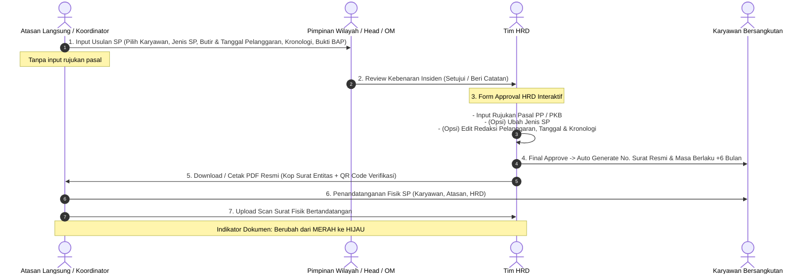

# 📋 Rencana Implementasi Terkonfirmasi: Fitur Surat Peringatan (SP)
**ASystem Portal — ESA Groups** (PT Arina Multikarya, PT Alva Karya Perkasa, PT Anugrah Terpercaya Kerja, PT Arina Bintang Oetama, PT Anugrah Tri Berkah)  
*Dokumen Rencana Teknis & Alur Operasional Fitur Surat Peringatan (SP)*

---

## 1. 📌 Keputusan & Konfirmasi Ruang Lingkup
Berdasarkan konfirmasi dan kebutuhan operasional:
1. **Jenis Surat**: Eksklusif hanya untuk **Surat Peringatan** yaitu:
   - **SP 1** : *Surat Peringatan I (Satu)* (Kode penomoran: `SPI`)
   - **SP 2** : *Surat Peringatan II (Dua)* (Kode penomoran: `SPII`)
   - **SP 3** : *Surat Peringatan III (Tiga / Terakhir)* (Kode penomoran: `SPIII`)  
   *(Tidak ada Surat Teguran / SP 0)*.
2. **Form Pengajuan (Sisi Requester / Atasan Langsung)**:
   - **Tidak ada input rujukan pasal**.
   - Input pengajuan mencakup:
     - Pemilihan Karyawan (Auto-lookup data profil: NIP, NIK, Nama, Jabatan, Area, Prinsiple, Entitas).
     - Usulan Jenis SP (`SP 1`, `SP 2`, `SP 3`).
     - **Butir-butir Pelanggaran Dinamis** (*multiple items*):
       - Uraian pokok pelanggaran.
       - Tanggal kejadian pelanggaran.
       - Kronologi detail kejadian per butir pelanggaran.
     - Berkas lampiran pendukung (BAP, foto kejadian, dokumen pendukung).
3. **Wewenang Khusus & Input Approval HRD**:
   - Bagian HRD yang melakukan approval diberikan form interaktif untuk:
     - **Menginputkan Rujukan Pasal** (Pasal Peraturan Perusahaan / PKB yang dilanggar) sebagai dasar hukum penerbitan surat.
     - **Mengubah Detail Pengajuan** sebelum disetujui:
       - Mengubah jenis/tingkat SP yang diajukan (misal usulan SP 1 disesuaikan menjadi SP 2 atau sebaliknya).
       - Mengedit redaksi ringkasan pelanggaran.
       - Menyesuaikan tanggal kejadian pelanggaran.
       - Mengedit kronologi agar redaksionalnya tepat dan sesuai kaidah hukum ketenagakerjaan.
   - Saat disetujui HRD, nomor resmi langsung di-generate otomatis dan status menjadi `approved`.

---

## 2. 🗄️ Skema Basis Data (Database Schema)

### A. Tabel Utama: `warning_letters`
| Kolom | Tipe | Keterangan |
| :--- | :--- | :--- |
| `id` | `bigint unsigned PK` | ID unik surat peringatan |
| `nomor_surat` | `varchar(100) nullable` | Nomor resmi (e.g. `001/SPI/AMK-SUB/IX/2026`), di-generate saat HRD Approve |
| `nomor_urut` | `integer unsigned nullable`| Nomor urut counter per entitas & tahun |
| `employee_id` | `bigint unsigned FK` | Relasi ke `employees.id` |
| `nip` | `varchar(50)` | Snapshot NIP karyawan |
| `nik` | `varchar(50)` | Snapshot NIK karyawan |
| `nama_karyawan` | `varchar(150)` | Snapshot nama karyawan |
| `jabatan` | `varchar(100)` | Snapshot jabatan |
| `area` | `varchar(100)` | Snapshot area penempatan |
| `singkatan_area` | `varchar(20)` | Singkatan kode area (e.g. `SUB`, `JKT`, `BDG`, `SMG`) |
| `prinsiple` | `varchar(150)` | Mitra kerja / Prinsiple |
| `entity` | `enum('AMK','AKP','ATK','ABO','ATB')`| Entitas perusahaan penerbit |
| `tingkat_sp` | `enum('sp1','sp2','sp3')` | Jenis SP (`sp1`, `sp2`, `sp3`) |
| `tingkat_sp_diajukan`| `enum('sp1','sp2','sp3')` | Jenis SP awal yang diajukan oleh requester |
| `tanggal_surat` | `date` | Tanggal penerbitan surat |
| `tanggal_expired` | `date` | Tanggal berakhir masa berlaku (+6 bulan dari tanggal surat) |
| `pasal_pelanggaran`| `text nullable` | **Diinput oleh HRD saat approval**: Rujukan pasal PP / PKB |
| `tindakan_perbaikan`| `text nullable` | Komitmen perbaikan / sanksi lanjutan jika berulang |
| `status` | `enum('draft','review_head','review_hrd','approved','rejected','expired')` | Status workflow |
| `posisi_approval` | `varchar(100)` | Posisi review saat ini (`Pimpinan Area`, `HRD`) |
| `file_pendukung` | `json nullable` | Berkas BAP / foto bukti yang diunggah saat pengajuan |
| `file_ttd_karyawan`| `varchar(255) nullable`| Scan surat fisik bertandatangan 3 pihak |
| `tgl_upload_ttd` | `datetime nullable` | Waktu unggah scan fisik bertandatangan |
| `created_by` | `bigint unsigned FK` | User pengaju (`users.id`) |
| `approved_by` | `bigint unsigned FK nullable` | User HRD yang menyetujui (`users.id`) |
| `created_at / updated_at` | `timestamps` | Waktu pencatatan |

### B. Tabel Detail Pelanggaran: `warning_letter_violations`
| Kolom | Tipe | Keterangan |
| :--- | :--- | :--- |
| `id` | `bigint unsigned PK` | ID butir pelanggaran |
| `warning_letter_id`| `bigint unsigned FK` | Relasi ke `warning_letters.id` (cascade delete) |
| `tanggal_pelanggaran`| `date` | Tanggal kejadian pelanggaran |
| `pelanggaran` | `text` | Redaksi ringkasan pelanggaran (dapat diedit HRD) |
| `kronologi` | `longtext` | Kronologi lengkap kejadian (dapat diedit HRD) |

### C. Tabel Log Approval: `warning_letter_approvals`
| Kolom | Tipe | Keterangan |
| :--- | :--- | :--- |
| `id` | `bigint unsigned PK` | ID log approval |
| `warning_letter_id`| `bigint unsigned FK` | Relasi ke `warning_letters.id` |
| `stage` | `varchar(50)` | `pimpinan_head`, `hrd` |
| `user_id` | `bigint unsigned FK` | User eksekutor aksi |
| `action` | `enum('approve','reject','revise')` | Keputusan |
| `perubahan_tingkat`| `varchar(50) nullable` | Catatan jika ada perubahan jenis SP (misal SP1 -> SP2) |
| `catatan` | `text nullable` | Catatan atau alasan pertimbangan |
| `created_at` | `datetime` | Waktu eksekusi |

### D. Tabel Counter Nomor Surat: `warning_letter_counters`
| Kolom | Tipe | Keterangan |
| :--- | :--- | :--- |
| `id` | `bigint unsigned PK` | ID counter |
| `entity` | `varchar(20)` | `AMK`, `AKP`, `ATK`, `ABO`, `ATB` |
| `tahun` | `year` | Tahun berjalan (e.g. 2026) |
| `last_number` | `integer unsigned` | Angka urut terakhir yang terpakai |

---

## 3. 🔢 Format Standar Penomoran Resmi (Otomatis saat Final Approval HRD)
$$\mathbf{[No. Urut (3 Digit)] / [Kode SP] / [Entitas]-[Kode Area] / [Bulan Romawi] / [Tahun]}$$

- **Kode SP**:
  - `SPI` : Surat Peringatan I (Satu)
  - `SPII` : Surat Peringatan II (Dua)
  - `SPIII` : Surat Peringatan III (Tiga)
- **Contoh Format Nyata**:
  - `001/SPI/AMK-SUB/IX/2026` (PT Arina Multikarya, Area Surabaya)
  - `014/SPII/AKP-JKT/X/2026` (PT Alva Karya Perkasa, Area Jakarta)
  - `003/SPIII/ATK-BDG/XI/2026` (PT Anugrah Terpercaya Kerja, Area Bandung)
  - `002/SPI/ABO-MDN/IX/2026` (PT Arina Bintang Oetama, Area Medan)
  - `001/SPI/ATB-DPS/IX/2026` (PT Anugrah Tri Berkah, Area Denpasar)

---

## 4. 🔄 Alur & Workflow Lengkap

---

## 5. 🖥️ Rincian Fitur UI/UX

### A. Form Pengajuan SP (`/warning-letters/create`)
- **Pencarian Pegawai**: Select2 / Modal pencarian NIK & Nama dari Master Karyawan. Begitu dipilih, info Jabatan, Area, Prinsiple, Entitas, dan status otomatis tampil.
- **Pilihan Jenis SP**: Radio button / Select (`SP 1`, `SP 2`, `SP 3`).
- **Dynamic Repeater Butir Pelanggaran**:
  - Tombol `+ Tambah Butir Pelanggaran`.
  - Tiap butir memiliki:
    1. Pokok Pelanggaran (Input Text).
    2. Tanggal Kejadian (Input Date).
    3. Detail Kronologi (Textarea).
  - Tombol `Hapus` pada butir jika lebih dari 1.
- **Upload Lampiran**: File pendukung BAP / foto (PDF, JPG, PNG).
- *Catatan: Tidak ada field rujukan pasal pada form ini.*

### B. Form Review & Approval Khusus HRD (`/warning-letters/{id}/review-hrd`)
- Tampilan detail data pengajuan awal dari Requester.
- **Area Edit HRD**:
  - Pilihan Jenis SP (dapat diubah dengan penjelasan di catatan).
  - Input **Rujukan Pasal PP / PKB** (Wajib diisi oleh HRD).
  - Baris butir pelanggaran yang dapat diedit secara langsung (teks pokok pelanggaran, tanggal, kronologi).
  - Input komitmen perbaikan & klausul peringatan.
- **Aksi Tombol**:
  - 🟢 **Setujui & Terbitkan Surat**: Memvalidasi data, men-generate nomor surat resmi, mengunci dokumen.
  - 🔴 **Tolak Pengajuan**: Mengembalikan pengajuan dengan catatan alasan penolakan.

### C. Daftar & Filter SP (`/warning-letters`)
- Tab Filter:
  - `Semua`
  - `Menunggu Review Atasan`
  - `Menunggu Approval HRD`
  - `Aktif (Disetujui)`
  - `Masa Berlaku Habis (Expired)`
  - `Ditolak`
- Indikator Status Scan Tanda Tangan:
  - 🔴 **Merah**: SP disetujui tapi berkas fisik bertandatangan belum diunggah.
  - 🟢 **Hijau**: Berkas fisik bertandatangan telah diunggah lengkap.

### D. Integrasi Master Karyawan
- Tab **"Riwayat SP & Disiplin"** pada halaman / modal detail Master Karyawan:
  - Menampilkan riwayat penerbitan SP bagi karyawan tersebut.
  - Indikator visual tingkat SP aktif untuk mencegah penerbitan ganda atau lompat tingkat tanpa verifikasi.

---

## 6. 📄 Template Cetak Dokumen PDF Resmi
- **Header Kop Surat Dinamis**: Logo dan alamat resmi sesuai entitas (`AMK`, `AKP`, `ATK`, `ABO`, `ATB`).
- **Nomor Surat Resmi**: Format lengkap sesuai counter urut per entitas.
- **Identitas Lengkap Karyawan**: NIK, Nama, Jabatan, Area, Prinsiple.
- **Rujukan Pasal & Landasan Hukum**: Pasal Peraturan Perusahaan / PKB yang diinputkan oleh HRD.
- **Uraian Butir Pelanggaran & Kronologi**: Tersusun rapi per poin pelanggaran.
- **Masa Berlaku**: Tanggal berlaku terhitung sejak tanggal surat sampai dengan +6 bulan ke depan.
- **Kolom Tanda Tangan 3 Pihak**: Karyawan yang bersangkutan, Atasan Langsung, dan HRD Management.
- **QR Code Keabsahan**: Untuk verifikasi keaslian surat digital.

---

## 7. 🚀 Rencana Tahapan Eksekusi (Implementation Roadmap)

1. **Tahap 1: Migration & Model Eloquent**
   - Migration `warning_letters`, `warning_letter_violations`, `warning_letter_approvals`, `warning_letter_counters`.
   - Model `WarningLetter`, `WarningLetterViolation`, `WarningLetterApproval`, `WarningLetterCounter`.
   - Hubungkan relasi ke model `Employee` dan `User`.
2. **Tahap 2: Routing, Controller & Approval Logic**
   - Daftarkan routes dengan proteksi middleware RBAC.
   - Buat `WarningLetterController`:
     - `index`, `create`, `store` (Pengajuan tanpa pasal).
     - `show` (Detail & timeline tracking).
     - `reviewHrd` & `approveHrd` (Edit detail, input pasal, generate nomor surat resmi).
     - `reject` (Penolakan dengan catatan).
     - `uploadSignedDoc` (Upload scan fisik bertandatangan).
3. **Tahap 3: Blade Views & UI Components**
   - View Index dengan statistik card dan datatable tab filter.
   - Form Create dengan dynamic repeater pelanggaran.
   - Form Review & Approval HRD yang interaktif.
   - Modal upload tanda tangan & preview berkas.
4. **Tahap 4: PDF Template & Cetak Dokumen Resmi**
   - Desain layout PDF ber-kop surat resmi 5 entitas ESA Groups.
   - Generator QR Code verifikasi dokumen.
5. **Tahap 5: Integrasi Master Karyawan & Shortcut Beranda**
   - Tambahkan tab riwayat SP di Master Karyawan.
   - Daftarkan modul ke widget Beranda.
6. **Tahap 6: Pengujian, Update Progress & Deployment**
   - Uji skenario lengkap dari pengajuan -> edit & approval HRD -> cetak PDF -> upload berkas.
   - Catat di `UPDATE_PROGRESS.md`, jalankan `graphify`, dan deploy ke server produksi.
